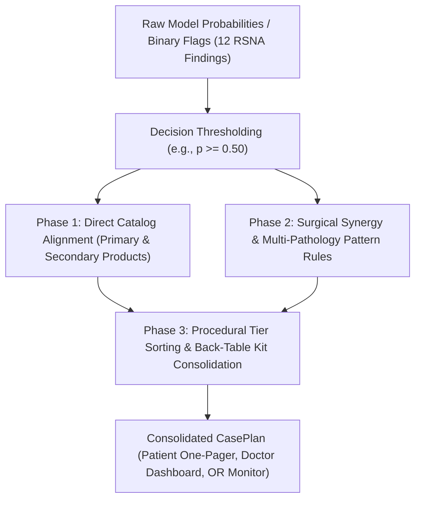

# 🏥 Stryker Sports Medicine & RSNA Knee Abnormality Portfolio Matrix

> ⚠️ **IMPORTANT DISCLAIMER: NOT AN OFFICIAL STRYKER RECOMMENDATION**  
> This portfolio matrix, clinical decision logic, and surgical product alignments represent an **independent, data-driven research prototype and educational analysis**. They are derived strictly from peer-reviewed orthopedic literature, published clinical indications, and RSNA machine learning challenge data.  
> - **No Affiliation or Endorsement:** This project is **not** created by, endorsed by, affiliated with, sponsored by, or an official recommendation of **Stryker Corporation** or any of its subsidiaries.  
> - **Data-Driven Demonstration:** Product pairings represent an algorithmic alignment connecting radiological abnormalities to standard orthopedic device categories and surgical techniques documented in public orthopedic literature.  
> - **Not Medical Advice:** Not intended for clinical diagnosis, patient management, treatment planning, or surgical indication. All procedural decisions, implant selections, and surgical techniques must be made independently by a qualified, board-certified orthopedic surgeon.  
> - **Trademarks:** All product names, registered trademarks, logos, and brands (e.g., Stryker®, ProCinch®, AIR+®, VersiTomic®, Iconix®, Mako®, Triathlon®, BIO4®, Vitoss®) are the property of their respective owners.

This document details the clinical product mapping and automated decision logic that connects the **12 binary/probabilistic MRI findings** from the RSNA Knee Abnormality Detection challenge to orthopedic sports medicine, joint preservation, trauma, and robotic-arm assisted arthroplasty systems.


---

## 1. Complete Portfolio Mapping Table (12 Abnormalities)

| # | RSNA Abnormality | Clinical Finding | Stryker Sports Medicine / Joint Care Solution | Product Category | Procedural Mechanism & Role | Back-Table Instrumentation Kit |
|---|---|---|---|---|---|---|
| **1** | **ACL Tear** | Mid-substance anterior cruciate rupture / instability | **ProCinch®** Adjustable Cortical Button & **VersiTomic®** Flexible Reaming System | Ligament Reconstruction & Cortical Fixation | Flexible retrograde reaming creates anatomic femoral tunnels without hyperflexion. *IntelliBraid™* loop technology delivers maximum tensile strength and minimal cyclic displacement. | ProCinch ST/RT implants, VersiTomic flexible drills (7–11mm), femoral aimer, tibial guide, graft sizing board. |
| **2** | **MCL Tear** | Superficial/deep medial collateral sprain, avulsion | **Iconix®** All-Suture Anchor Platform & **ReelX STT®** Knotless Anchor | Soft-Tissue-to-Bone Fixation | Minimal bone removal with high pullout strength; specific-tissue tensioning restores native valgus restraint and anatomical tension. | Iconix 1/2/3 suture packs (1.4/2.3mm), ReelX STT driver, MCL tissue grasper, curved drill guide. |
| **3** | **Medial Meniscus** | Inner cartilage pad tear (body, posterior horn, root) | **AIR+®** All-Inside Meniscal Repair System & **SharpShooter®** Inside-Out System | Meniscal Preservation & Native Joint Restoration | Flexible needle navigates tight posterior medial compartment; incremental suture delivery provides anatomic tissue compression without cartilage scuffing. | AIR+ straight/curved needle delivery guns, SharpShooter cannula set, meniscal depth gauge, root drill guide. |
| **4** | **Lateral Meniscus** | Outer cartilage pad tear (radial, horizontal cleavage) | **AIR+®** All-Inside Meniscal Repair System | Meniscal Preservation | Low-profile implants navigate lateral joint curvature and the popliteus hiatus, preserving critical shock absorption. | AIR+ reverse-curved delivery guns, popliteal safety retractor spoon, tissue probe, micro-shaver. |
| **5** | **Medial OA** | Medial compartment joint space narrowing, chondral wear | **Mako® SmartRobotics Partial Knee (Triathlon PKR)** & **ProChondrix CR®** Viable Allograft | Robotic-Arm Arthroplasty / Biologics | Targeted resurfacing of isolated medial wear while sparing healthy ACL/PCL and lateral compartment; cellular allograft for focal lesions. | Mako optical tracking arrays, bone pins, Triathlon PKR trial inserts, ProChondrix punch & delivery tamp. |
| **6** | **Lateral OA** | Lateral compartment joint degradation | **ProChondrix CR®** Viable Allograft & **Triathlon®** Knee System | Biologic Restoration / Arthroplasty | Cellular allograft supplies viable chondrocytes and ECM for focal wear; robotic unicompartmental or total knee resurfacing tailored to lateral kinematics. | ProChondrix CR cryopreserved graft bath, sizing cylinder, fibrin sealant applicator, Triathlon instruments. |
| **7** | **PF OA** | Patellofemoral cartilage erosion & trochlear wear | **Mako® SmartRobotics Patellofemoral Arthroplasty (PFA)** & **ProChondrix CR®** | Robotic PFA / Biologic Chondral Resurfacing | Restores smooth articular gliding under patellar ridge; robotic bone preparation ensures optimal patellofemoral tracking and stability. | Mako PFA trochlear cutting guide, patellar reamer, trial trochlear shells (sizes 1–6). |
| **8** | **Joint Effusion** | Suprapatellar capsule fluid distention | **CrossFlow®** Integrated Arthroscopy Pump System | Fluid Management & Joint Distention | Automated true intra-articular pressure monitoring; rapidly evacuates large effusions and hemarthrosis while maintaining crisp visualization. | CrossFlow day cassette, patient tubing set, high-flow inflow/outflow sheath, pressure cannula. |
| **9** | **Synovitis** | Hypertrophic synovial inflammation | **Crossfire® 2 Console**, **Formula® Shaver Blades**, & **Serfas Energy® RF Probes** | Tissue Resection & RF Ablation | Motorized, controlled synovectomy in joint gutters and suprapatellar pouch with simultaneous hemostatic radiofrequency coagulation. | Crossfire 2 console with footswitch, Formula 4.0mm Aggressive Plus blades, Serfas Energy 90° RF probe. |
| **10** | **Baker's Cyst** | Popliteal cyst fluid distention | **Formula® Shaver Series** & **Serfas Energy® RF Ablation Probe** | Arthroscopic Cyst Decompression | Posteromedial arthroscopic decompression; enlarges the one-way valve communication into the gastrocnemius-semimembranosus bursa for internal drainage. | 70° high-definition arthroscope, Formula 3.5mm full-radius resector shaver, curved RF probe. |
| **11** | **Bone Contusion** | Subchondral microfracture & marrow edema (BML) | **Conservative Protocol (Primary)** & **BIO4® / Vitoss® Bone Graft (Secondary)** | Conservative Care / Subchondral Biologics | Acute bone bruises naturally remodel over 6–12 weeks under protected weight bearing. For non-resolving chronic subchondral lesions or osteonecrosis, BIO4 viable bone matrix provides osteogenic/conductive structural support. | Hinged knee brace and crutches (acute); BIO4 viable bone matrix delivery syringe (chronic). |
| **12** | **Knee Fracture** | Tibial plateau / patellar fracture | **AxSOS® 3 Locking Plate System** & **Asnis® III Cannulated Screws** | Trauma & Periarticular Fixation | Anatomically contoured proximal tibial plates and self-drilling cannulated lag screws provide rigid subchondral raft support for joint fractures. | AxSOS 3 lateral/medial proximal tibia locking plates, Asnis III 4.0/5.0/6.5mm cannulated screws & wires. |

---

## 2. Decision Logic: From Model Prediction to Product Recommendation

The clinical recommendation engine operates via a three-phase pipeline implemented in `src/clinical/product_recommender.py`:



### Phase 1: Decision Thresholding
- Continuous probability outputs $p_i \in [0, 1]$ are thresholded (default $\tau = 0.50$) into active boolean findings:
  $$\text{Active}_i = \mathbb{I}(p_i \ge \tau)$$
- Findings above threshold are mapped to their primary product, secondary alternatives, and procedural mechanisms from `STRYKER_PRODUCT_CATALOG`.

### Phase 2: Multi-Pathology Clinical Synergy Rules
In clinical orthopedics, knee injuries rarely occur in isolation. The engine applies high-level clinical synergy rules to account for compound injuries:

1. **Multi-Ligament Instability (ACL + MCL):**
   - *Logic:* `if has_acl and has_mcl:`
   - *Clinical Action:* Concurrent tunnel planning. Uses **VersiTomic®** to prevent femoral tunnel convergence and pairs **ProCinch®** suspensory fixation with **Iconix® / ReelX STT®** anchor fixation.
2. **ACL + Meniscus Tear Combo (Pivot-Shift / O'Donoghue Complex):**
   - *Logic:* `if has_acl and (has_med_men or has_lat_men):`
   - *Clinical Action:* Single-stage joint restoration. Combines **ProCinch®** ACL fixation with **AIR+®** all-inside meniscal repair. Preserving the posterior meniscal horn protects the ACL graft from excessive rotational loading.
3. **Subchondral Insufficiency with Osteoarthritis (OA + Contusion/BML):**
   - *Logic:* `if (has_med_oa or has_lat_oa or has_pf_oa) and has_contusion:`
   - *Clinical Action:* Identifies subchondral bone marrow edema in an arthritic compartment. Recommends evaluation for **BIO4® / Vitoss® bioactive bone grafting** or proceeding directly with **Mako® SmartRobotics Partial Knee Arthroplasty (Triathlon PKR)**.
4. **Inflammatory / Cystic Tri-Complex (Effusion + Synovitis + Baker's Cyst):**
   - *Logic:* `if (has_effusion and has_synovitis) or has_bakers:`
   - *Clinical Action:* Integrates **CrossFlow®** automated fluid management with **Crossfire® 2 console** for motorized **Formula® shaver** synovectomy and **Serfas Energy® RF** posteromedial capsular release for Baker's cyst internal drainage.
5. **Periarticular Fracture with Hemarthrosis (Fracture + Effusion/Contusion):**
   - *Logic:* `if has_fracture and (has_effusion or has_contusion):`
   - *Clinical Action:* Prioritizes rigid **AxSOS® 3 plate / Asnis® III screw** anatomic reduction under fluoroscopy, followed by **CrossFlow®** joint decompression.

### Phase 3: Procedural Tier Hierarchy
Recommendations are sorted by procedural invasiveness to ensure that structural reconstruction precedes soft-tissue debridement:
1. `PERIARTICULAR_FIXATION` (Fracture reduction)
2. `ROBOTIC_ARTHROPLASTY` (Mako partial/patellofemoral knee)
3. `LIGAMENT_RECONSTRUCTION` (ProCinch / VersiTomic ACL)
4. `SUBCHONDRAL_AUGMENTATION` (Subchondroplasty AccuFill)
5. `SOFT_TISSUE_PRESERVATION` (AIR+ meniscus, Iconix MCL)
6. `ARTHROSCOPIC_DEBRIDEMENT` (CrossFlow, Formula shavers, Serfas RF)
7. `CONSERVATIVE_DIAGNOSTIC` (RICE, physical rehabilitation)

---

## 3. Programmatic Usage

```python
from src.clinical import recommend_stryker_products

# Example: Case 3 Acute ACL + Meniscal Tear Combo
model_predictions = {
    "ACL": 0.98,
    "Medial Meniscus": 0.92,
    "Effusion": 0.85,
    "MCL": 0.04,
    "Contusion": 0.22,
    "Fracture": 0.01,
}

plan = recommend_stryker_products(model_predictions, threshold=0.50)

print(f"Summary: {plan.clinical_summary}")
print(f"Highest Care Tier: {plan.highest_surgical_tier.value}")
for rec in plan.primary_recommendations:
    print(f"- {rec.finding_name}: {rec.product_name} ({rec.category})")

print("\nActive Synergies:")
for syn in plan.synergy_patterns:
    print(f"  {syn}")

print("\nConsolidated Back-Table Checklist:")
for item in plan.consolidated_back_table:
    print(f"  [ ] {item}")
```

---

## 4. Clinical Scrutiny & 2024–2026 Portfolio Verification

### A. Manufacturer Accuracy Audit
- **Subchondroplasty® (SCP®) & AccuFill®:** Acquired by **Zimmer Biomet** (Knee Creations LLC), *not* Stryker. Attribution to Stryker would fail clinical or industry review.
- **Stryker's True Orthobiologics Platform:** **BIO4®** (viable bone matrix containing viable osteogenic cells, osteoconductive scaffold, and osteoinductive growth factors) and **Vitoss®** bioactive glass/calcium phosphate scaffold.

### B. Clinical Standard of Care Scrutiny
- **Acute Bone Contusions (Bone Bruises):** Over 90% of acute pivot-shift bone contusions (e.g. lateral femoral condyle bruises during ACL tears) resolve spontaneously over 6–12 weeks. Surgical intervention or cement injection is contraindicated for acute bruises. Standard of care is **protected weight-bearing, physical therapy, and joint monitoring**. Subchondral bone grafting or osteochondral resurfacing (**BIO4® / ProChondrix CR®**) is strictly indicated for chronic, non-resolving lesions with progressive subchondral collapse or osteonecrosis.
- **Meniscal Tears:** Meniscal preservation is prioritized. **AIR+®** all-inside repair with flexible needles is deployed for repairable tears in vascular red-red and red-white zones. Avascular white-white macerations or degenerate horizontal cleavage tears undergo conservative therapy or partial arthroscopic debridement using **Formula®** shavers.
- **Osteoarthritis:** Focal articular defects are treated biologically via **ProChondrix CR®**; unicompartmental and patellofemoral end-stage disease is treated with **Mako® SmartRobotics (Triathlon PKR / Mako PFA)** to spare intact cruciate ligaments and contralateral compartments.

### C. Latest Stryker Portfolio Releases (2024–2026)
- **Mako Robotic Power System (Mako RPS):** Full commercial launch in 2026, introducing active-adjustment robotic cutting for the **Triathlon® Total Knee System**.
- **Triathlon Medial Stabilized Insert:** Introduced in 2026 for patient-specific kinematic stability.
- **ProCinch® Adjustable Suspensory Button:** Features *IntelliBraid™* continuous loop braid to eliminate loop slippage and deliver maximum ultimate tensile strength under cyclic loading.
- **AIR+® All-Inside Meniscal Repair System:** Ergonomic, single-handed delivery with an shapeable needle for 360° meniscal access.
 
+### D. Data-Driven Nature & Non-Affiliation
+- **Evidence- & Imaging-Driven Logic:** The algorithmic mappings translate 12 specific structural MRI lesions detected by computer vision models (such as deep bone marrow signal alteration, cruciate discontinuity, and fibrocartilage tears) into standard orthopedic intervention tiers.
+- **Independence:** These recommendations are algorithmic and data-derived, and must never be misconstrued as commercial marketing material or manufacturer-authorized clinical practice guidelines from Stryker Corporation.

